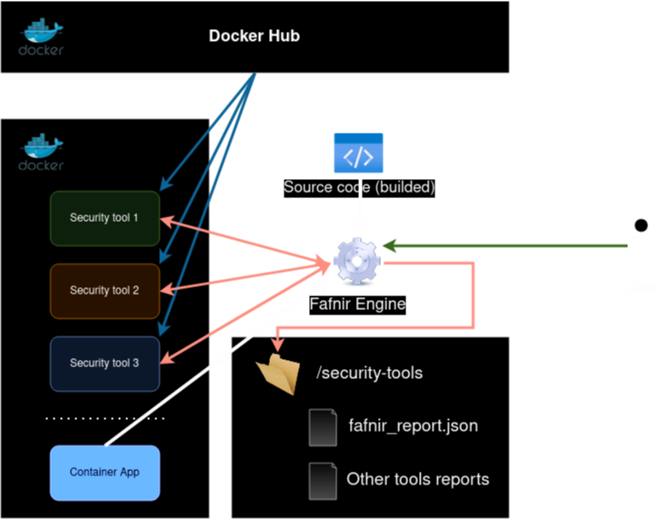

# Fafnir

<div align="center">


<br/>

[Fafnir](#what-is-fafnir)
**·**
[Install](#installation)
**·**
[Usage](#usage)
**·**
[Configuration](#configuration)
**·**
[Security Tools](#security-tools)
**·**
[Architecture](#architecture)
**·**
[FaQ](#faq)

</div>

## What is Fafnir?

**Fafnir** is an open-source tool that allows for the complete automation of launching different security tools detecting vulnerabilities in the application's code. 

This tool reports vulnerabilities in the different parts of the supply chain management, like source code, dependencies, containers, infrastructure as code...

> Fafnir was a dwarf-like creature in Norse mythology, who transformed himself into a terrifying dragon to protect his treasure. [More about his history](https://vikingr.org/other-beings/fafnir)

* Official documentation: TO DO

## Architecture

The tool runs the security tools using Docker containers (official images or self-created).

<div align="center">

</div>

Fafnir gets the tools from Docker Hub and, using the builded source code and/or the application container, detects the vulnerabilities, reporting it in a single, simple and standard JSON file with all the details of all the vulnerabilities detected.

Also, Fafnir detects all the technologies used in your project and only executes the security tools that have support. In this way, the tool only use the necessary tools and it improves the performance and the speed of the execution.

## Installation

### Requirements

* Python 3.6 or later
* Docker installed
* Internet access to pull security tool images

TO DO

## Usage

To check the options available in the CLI, you can run the following command:

`fafnir --help`

### Options

#### Mandatory parameters

* **SCAN_FULLPATH**: Pre-builded source code fullpath to analyze

#### Optional flags

* **--configuration**: Fafnir configuration file with all the options

* **--asynchronous**: Asynchronous mode to run all security tools at the same time

* **--output-path**: Path to store the reports

* **--disable-apis**: Disable API requests to get external information

### Recommendations

* Previous project build/compilation
* If you use a Docker image, previous build in local registry to scan
* Read all `fafnir_config.yml` and configure it

## Configuration

TO DO

## Security tools

We are continuously improving our open-source supported tools, growing up the detection engine and the performance of the scan.

To know the supported languages and technologies, review the integrated tools.

### Integrated

|Tool|Tipology|API key|
|----|--------|------|
|Semgrep|SAST|Recommended|
|Bandit|SAST|No|
|FindSecBugs|SAST|No|
|Gitleaks|Secrets Scanning|No|
|osv-scanner|SCA|No|
|Trivy|SCA|No|
|Trivy|Container Security Scan|No|
|Checkov|IaC Scan|Recommended|
|Syft|SBOM generator|No|


### In roadmap

|Tool|Tipology|Status|
|----|--------|------|
|Nuclei|DAST|TO DO|
|DevSkim|SAST|TO DO|
|Brakeman|SAST|TO DO|
|Lunasec|SAST|TO DO|
|GoSec|SAST|TO DO|
|Insider|SAST|TO DO|
|MobSF|SAST & DAST|TO DO|

## Supported languages and technologies

## FAQ

### PermissionError due to Docker container run

>docker.errors.DockerException: Error while fetching server API version: ('Connection aborted.', PermissionError(13, 'Permission denied'))

To fix this issue, yo can run the following command to elevate the Docker socket permissions:


```bash
sudo chmod 666 /var/run/docker.sock
```

### Slow first run execution

In the first run, Fafnir needs to pull all security tools images from Docker Hub. The first run may not delay more than 2 - 5 minutes, depending on your network connection.
